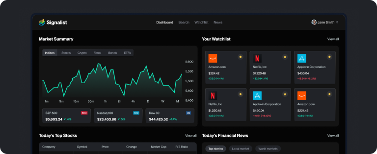

# 📈 Signalist - Stock Market Tracking & Analysis Platform

A modern, full-stack stock market tracking application built with Next.js 15, featuring real-time market data visualization, personalized watchlists, and AI-powered daily news summaries delivered via email.



## ✨ Features

### 🔐 Authentication & User Management

- Secure email-based authentication powered by Better Auth
- Personalized user profiles with investment preferences
- Country selection, investment goals, risk tolerance, and industry preferences
- Email verification and account management

### 📊 Market Data & Visualization

- **Market Overview Dashboard** - Real-time market indices and trends
- **Stock Heatmap** - Visual representation of market performance
- **Top Stories Timeline** - Latest financial news and updates
- **Market Quotes** - Live stock prices and market data
- **Detailed Stock Analysis**:
  - Interactive candlestick charts
  - Baseline charts for trend analysis
  - Technical analysis indicators
  - Company profiles and financials
  - Real-time symbol information

### 📝 Watchlist Management

- Add stocks to your personalized watchlist
- Track multiple stocks in one place
- Quick access to your favorite companies
- Watchlist-based news updates

### 📧 AI-Powered Email Features

- **Personalized Welcome Emails** - AI-generated onboarding messages tailored to user preferences
- **Daily News Summaries** - Automated daily emails with:
  - News relevant to your watchlist stocks
  - AI-summarized market insights
  - Scheduled delivery at noon daily
  - Fallback to general market news if watchlist is empty

### 🔍 Search & Discovery

- Fast command palette search for stocks
- Quick navigation to stock details
- Responsive search interface

## 🛠️ Tech Stack

### Frontend

- **Next.js 15** - React framework with App Router
- **React 19** - Latest React features
- **TypeScript** - Type-safe development
- **Tailwind CSS 4** - Modern styling with utility classes
- **shadcn/ui** - Beautiful, accessible component library
- **Radix UI** - Unstyled, accessible UI primitives
- **React Hook Form** - Performant form validation
- **Sonner** - Elegant toast notifications
- **Lucide React** - Modern icon library

### Backend & Infrastructure

- **Next.js Server Actions** - Type-safe server functions
- **Better Auth** - Modern authentication library
- **MongoDB** - NoSQL database
- **Mongoose** - MongoDB object modeling
- **Inngest** - Background job orchestration and cron scheduling
- **Nodemailer** - Email delivery service

### APIs & Integrations

- **TradingView Widgets** - Professional-grade market visualizations
- **Finnhub API** - Real-time stock data and news
- **Google Gemini AI** - AI-powered content generation for emails

## 🚀 Installation

1. **Clone the repository**

   ```bash
   git clone https://github.com/yourusername/stocks_app.git
   cd stocks_app
   ```

2. **Install dependencies**

   ```bash
   npm install
   ```

3. **Set up environment variables**

   Create a `.env.local` file in the root directory:

   ```env
   # Database
   MONGODB_URI=your_mongodb_connection_string

   # Better Auth
   BETTER_AUTH_SECRET=your_secret_key
   BETTER_AUTH_URL=http://localhost:3000

   # Finnhub API
   FINNHUB_API_KEY=your_finnhub_api_key

   # Email Service (Nodemailer)
   EMAIL_HOST=smtp.gmail.com
   EMAIL_PORT=587
   EMAIL_USER=your_email@gmail.com
   EMAIL_PASSWORD=your_app_password
   EMAIL_FROM=your_email@gmail.com

   # Inngest
   INNGEST_EVENT_KEY=your_inngest_event_key
   INNGEST_SIGNING_KEY=your_inngest_signing_key

   # Google Gemini AI
   GEMINI_API_KEY=your_gemini_api_key
   ```

4. **Test database connection** (optional)

   ```bash
   npm run test:db
   ```

5. **Run the development server**

   ```bash
   npm run dev
   ```

6. **Open your browser**

   Navigate to [http://localhost:3000](http://localhost:3000)
